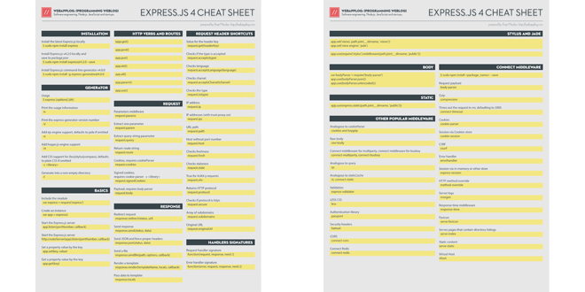

# Express.js 4 Cheatsheet

> These people are the Sparta’s walls.

Beautifully-designed print-ready [PDF](https://node.university/p/library)

[](https://node.university/p/library)

## Installation

* `$ sudo npm install express`: install the latest Express.js  locally
* `$ sudo npm install express@4.2.0 --save`: install Express.js v4.2.0 locally and save to `package.json`
* `$ sudo npm install -g express-generator@4.0.0`: install Express.js command-line generator v4.0.0

## Generator


Usage: `$ express [options] [dir]`

Options:

* `-h`: print the usage information
* `-V`: print the express-generator version number
* `-e`: add ejs engine support, defaults to jade if omitted
* `-H`: add hogan.js engine support
* `-c <library>`  add CSS support for <library> (less|stylus|compass), defaults to plain CSS if omitted
* `-f`: generate into a non-empty directory

## Basics

* `var express = require('express')`: include the module
* `var app = express()`: create an instance
* `app.listen(portNumber, callback)`: start the Express.js server
* `http.createServer(app).listen(portNumber, callback)`: start  the Express.js server
* `app.set(key, value)`: set a property value by the key
* `app.get(key)`: get a property value by the key


## HTTP Verbs and Routes

* `app.get(urlPattern, requestHandler[, requestHandler2, ...])`
* `app.post(urlPattern, requestHandler[, requestHandler2, ...])`
* `app.put(urlPattern, requestHandler[, requestHandler2, ...])`
* `app.delete(urlPattern, requestHandler[, requestHandler2, ...])`
* `app.all(urlPattern,  requestHandler[, requestHandler2, ...])`
* `app.param([name,] callback)`:
* `app.use([urlPattern,] requestHandler[, requestHandler2, ...])`

## Request

* `request.params`: parameters middlware
* `request.param`: extract one parameter
* `request.query`: extract query string parameter
* `request.route`: return route string
* `request.cookies`: cookies, requires `cookie-parser`
* `request.signedCookies`: signed cookies, requires `cookie-parser`
* `request.body`: payload, requires `body-parser`

## Request Header Shortcuts

* `request.get(headerKey)`: value for the header key
* `request.accepts(type)`: checks if the type is accepted
* `request.acceptsLanguage(language)`: checks language
* `request.acceptsCharset(charset)`: checks charset
* `request.is(type)`: checks the type
* `request.ip`: IP address
* `request.ips`: IP addresses (with trust-proxy on)
* `request.path`: URL path
* `request.host`: host without port number
* `request.fresh`: checks freshness
* `request.stale`: checks staleness
* `request.xhr`: true for AJAX-y requests
* `request.protocol`: returns HTTP protocol
* `request.secure`: checks if protocol is `https`
* `request.subdomains`: array of subdomains
* `request.originalUrl`: original URL

## Response

* `response.redirect(status, url)`: redirect request
* `response.send(status, data)`: send response
* `response.json(status, data):` send JSON and force proper headers
* `response.sendfile(path, options, callback)`: send a file
* `response.render(templateName, locals, callback)`: render a template
* `response.locals`: pass data to template

## Handlers Signatures

* `function(request, response, next) {}`: request handler signature
* `function(error, request, response, next) {}`: error handler signature


## Stylus and Jade

```
app.set('views', path.join(__dirname, 'views'))
app.set('view engine', 'jade')
```

`app.use(require('stylus').middleware(path.join(__dirname, 'public')))`

## Body

```
var bodyParser = require('body-parser')
app.use(bodyParser.json())
app.use(bodyParser.urlencoded({
    extended: true
}))
```

## Static

`app.use(express.static(path.join(__dirname, 'public')))`

## Connect Middleware

`$ sudo npm install <package_name> --save`

* [body-parser](https://github.com/expressjs/body-parser) request payload
* [compression](https://github.com/expressjs/compression) gzip
* [connect-timeout](https://github.com/expressjs/timeout)
* [cookie-parser](https://github.com/expressjs/cookie-parser) Cookies
* [cookie-session](https://github.com/expressjs/cookie-session) Session via Cookies store
* [csurf](https://github.com/expressjs/csurf) CSRF
* [errorhandler](https://github.com/expressjs/errorhandler) error handler
* [express-session](https://github.com/expressjs/session) session via in-memory or other store
* [method-override](https://github.com/expressjs/method-override) HTTP method override
* [morgan](https://github.com/expressjs/morgan) server logs
* [response-time](https://github.com/expressjs/response-time)
* [serve-favicon](https://github.com/expressjs/serve-favicon) favicon
* [serve-index](https://github.com/expressjs/serve-index)
* [serve-static](https://github.com/expressjs/serve-static) static content
* [vhost](https://github.com/expressjs/vhost)


## Other Popular Middleware
* [cookies](https://github.com/jed/cookies) and [keygrip](https://github.com/jed/keygrip): analogous to `cookie-parser`
* [raw-body](https://github.com/stream-utils/raw-body)
* [connect-multiparty](https://github.com/superjoe30/connect-multiparty), [connect-busboy](https://github.com/mscdex/connect-busboy)
* [qs](https://github.com/visionmedia/node-querystring): analogous to `query`
* [st](https://github.com/isaacs/st), [connect-static](https://github.com/andrewrk/connect-static) analogous to `staticCache`


* [express-validator](https://github.com/ctavan/express-validator): validation
* [less](https://github.com/emberfeather/less.js-middleware): LESS CSS
* [passport](https://github.com/jaredhanson/passport): authentication library
* [helmet](https://github.com/evilpacket/helmet): security headers
* [connect-cors](http://github.com/antono/connect-cors): CORS
* [connect-redis](http://github.com/visionmedia/connect-redis)
