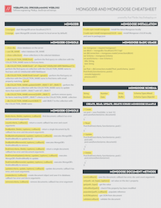

# MongoDB and Mongoose Cheatsheet

FREE beautifully-designed print-ready [PDF](https://node.university/p/library)

[](https://node.university/p/library)

## MongoDB

* `$ mongod`: start MongoDB server (localhost:27017)
* `$ mongo`: open MongoDB console (connect to local server by default)

## MongoDB Console

* `> show dbs`: show databases on the server
* `> use DB_NAME`: select database `DB_NAME`
* `> show collections`: show collections in the selected database
* `> db.COLLECTION_NAME.find()`: perform the find query on collection with the COLLECTION_NAME name to find any items
* `> db.COLLECTION_NAME.find({"_id": ObjectId("549d9a3081d0f07866fdaac6")})`: perform the find query on collection with the COLLECTION_NAME name to find item with ID 549d9a3081d0f07866fdaac6
* `> db.COLLECTION_NAME.find({"email": /gmail/})`: perform the find query on collection with the COLLECTION_NAME name to find items with email property matching `/gmail`
* `> db.COLLECTION_NAME.update(QUERY_OBJECT, SET_OBJECT)`: perform the update query on collection with the COLLECTION_NAME name to update items that match QUERY_OBJECT with SET_OBJECT
* `> db.COLLECTION_NAME.remove(QUERY_OBJECT)`: perform remove query for items matching QUERY_OBJECT criteria on the COLLECTION_NAME collection
* `> db.COLLECTION_NAME.insert(OBJECT)`: add OBJECT to the collection with the COLLECTION_NAME name


## Mongoose Installation

* `$ sudo npm install mongoose`: install the latest Mongoose locally`
* `$ sudo npm install mongoose@3.8.20 --save`: install Mongoose v3.8.20 locally and save to `package.json`

## Mongoose Basic Usage

```
var mongoose = require('mongoose')
var dbUri = 'mongodb://localhost:27017/api'
var dbConnection = mongoose.createConnection(dbUri)
var Schema = mongoose.Schema
var postSchema = new Schema ({
  title: String,
  text: String
})
var Post = dbConnection.model('Post', postSchema, 'posts')
Post.find({},function(error, posts){
  console.log(posts)
  process.exit(1)
})
```

## Mongoose Schema

* `String`
* `Boolean`
* `Number`
* `Date`
* Array
* `Buffer`
* `Schema.Types.Mixed`
* `Schema.Types.ObjectId`

## Create, Read, Update, Delete (CRUD) Mongoose Example

```
// Create
var post = new Post({title: 'a', text: 'b')
post.save(function(error, document){
  ...
})


// Read
Post.findOne(criteria, function(error, post) {
  ...
})

// Update
Post.findOne(criteria, function(error, post) {
  post.set()
  post.save(function(error, document){
    ...
  })
})

// Delete
Post.findOne(criteria, function(error, post) {
  post.remove(function(error){
    ...
  })
})
```

## Mongoose Model Methods


* `find(criteria, [fields], [options], [callback])`: find document; callback has error and documents arguments
* `count(criteria, [callback]))`: return a count; callback has error and count arguments
* `findById(id, [fields], [options], [callback])`: return a single document by ID; callback has error and document arguments
* `findByIdAndUpdate(id, [update], [options], [callback])`: executes MongoDB's findAndModify to update by ID
* `findByIdAndRemove(id, [options], [callback])`: executes MongoDB's findAndModify to remove
* `findOne(criteria, [fields], [options], [callback])`: return a single document; callback has error and document arguments
* `findOneAndUpdate([criteria], [update], [options], [callback])`: executes MongoDB's findAndModify to update
* `findOneAndRemove(id, [update], [options], [callback])`: executes MongoDB's findAndModify to remove
* `update(criteria, update, [options], [callback])`: update documents; callbach has error, and count arguments
* `create(doc(s), [callback])`: create document object and save it to database; callback has error and doc(s) arguments
* `remove(criteria, [callback])`: remove documents; callback has error argument

## Mongoose Document Methods

* `save([callback])`: save the document; callback has error, doc and count arguments
* `set(path, val, [type], [options])`: set value on the doc's property
* `get(path, [type])`: get the value
* `isModified([path])`: check if the property has been modified
* `populate([path], [callback])`: populate reference
* `toJSON(options)`: get JSON from document
* `validate(callback)`: validate the document
